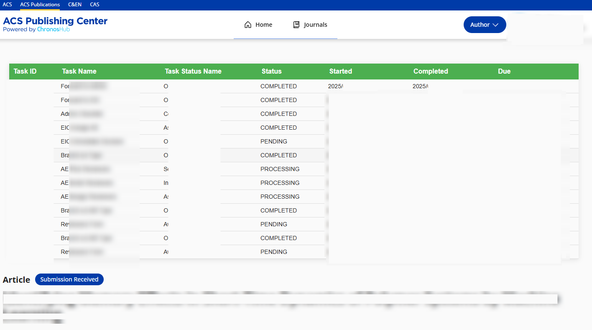

# ACS Tracker
A script designed to track the detailed submission status on the ACS Publishing Platform.

**Note:** **_ACS Tracker is not affiliated with or endorsed by the ACS. Use at your own risk._**

## Installation
1. **Install Tampermonkey**
   - Edge: Install [Tampermonkey](https://microsoftedge.microsoft.com/addons/detail/tampermonkey/iikmkjmpaadaobahmlepeloendndfphd).  
   - Chrome: Install [Tampermonkey](https://chrome.google.com/webstore/detail/tampermonkey/dhdgffkkebhmkfjojejmpbldmpobfkfo).  
   - Firefox: Install [Tampermonkey](https://addons.mozilla.org/en-US/firefox/addon/tampermonkey/).  

2. **Enable Developer Mode for the Extension**
   - For Edge: Go to `edge://extensions/` and enable "Developer mode" on the left.
   - For Chrome: Go to `chrome://extensions/` and enable "Developer mode" in the top right corner.  
   - For Firefox: Go to `about:addons`, click the gear icon, and select "Debug Add-ons".  

3. **Install ACS Tracker Script**  
   Click [here](https://github.com/zhangkaihua88/ACS-Tracker/raw/refs/heads/main/acsTracker.user.js) to automatically install the script, or install it directly from the [GreasyFork page](https://greasyfork.org/zh-CN/scripts/539931-acs-tracker).

## Usage Guide
1. **Login to ACS Publishing**
   Make sure you are logged into the ACS Publishing system at [ACS Publishing Login](https://publish.acs.org/app/login?code=1000).

2. **Access the Manuscript Detail Page**
   Click the title of your submission to open the manuscript detail page in the ACS Publishing system. The page URL will look like `https://publish.acs.org/app/manuscript?*` (for example, `https://publish.acs.org/app/manuscript?id=123456`).  

3. **View the Tracking Table**
   A detailed status table will automatically appear on the page, showing:  
   

---

## Status Interpretation

**_Disclaimer: The following interpretations are based on statistical analysis and personal inference, and may not fully reflect the actual workflow of the ACS system._**

**Table Column Explanation:**
- **Task Name:** The specific task in the workflow.
- **Task Status Name:** Supplementary information for the Task Name, indicating the current status.
- **Start:** The time when the task began.
- **Completed:** The time when the task was completed.
- **Due:** The duration taken to complete the task.

**Notes on Statuses:**
1. When the Task Name is "AE Pick Reviewers" and its start time matches the completion time of "EIC Assign AE", this does not necessarily indicate that the manuscript has been sent out for review. At this point, the Associate Editor (AE) is likely still making a decision, and "AE Pick Reviewers" may simply be a procedural step.
2. When the Task Name is "Reviewers Form" (with Task Status Name "Awaiting Review"), it means the manuscript is pending review. The number of such entries typically corresponds to the number of reviewers assigned.